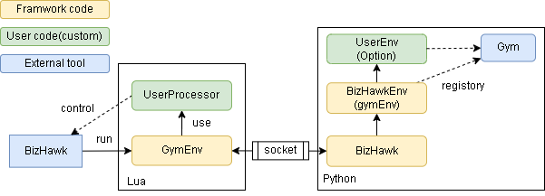

[](https://github.com/pocokhc/GymBizHawk/releases/latest)

# GymBizhawk

これはマルチシステムエミュレータである[BizHawk](https://github.com/TASEmulators/BizHawk)と強化学習用の標準APIを提供する[Gymnasium(Gym)](https://github.com/Farama-Foundation/Gymnasium/tree/main)の連携ライブラリです。  
GymのAPI上でBizHawkを動かすことを目的としています。

# 1. Install/Download
## 1-1. BizHawk install

[BizHawk](https://github.com/TASEmulators/BizHawk) をインストールしてください。
（version: 2.9.1）

## 1-2. GymBizHawk install

本フレームワークはダウンロードして使います。
（Python version: 3.12.2）

``` bash
git clone https://github.com/pocokhc/GymBizHawk.git
cd GymBizHawk
pip install -r requirements.txt  # install libraries
pip install .  # install GymBizHawk & register Gym
```

## 1-3. Sample Usage

``` bash
# set Environmental Variables
> SET BIZHAWK_DIR="BizHawk dir path"
> SET ROM_DIR="ROM path"
# run
> python examples/main.py
```

# 2. Customize

+ [Make Original Environment](https://pocokhc.github.io/GymBizHawk/pages/custom.html)

## Samples

+ とりあえず動かしてみたい(I want to move it for now)
    + examples/main.py
+ Lua側を作って動かしてみる(I want to add the lua side and create it.)
    + examples/PS_moon/
    + examples/NES_SMB/
+ 1stepの挙動も細かく制御して作成したい(I want to control and create the behavior of 1 step.)
    + examples/NES_DrMario/


# 3. Overview


