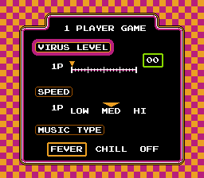

# DrMario

DrMarioを実行するサンプルです。


# How to play

1. Save position

LV0にカーソルを合わせた状態で9slotにQSしてください。
（以下の画像を参考）



（SPEEDとMUSIC TYPEは影響ありません。）


2. 環境変数を設定
```
BIZHAWK_DIR  : BizHawkのディレクトリを設定
DRMARIO_PATH : DrMarioのROMパスを設定
```

3. "./main.py"をpythonで実行

