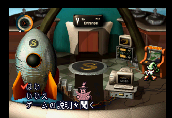

# moon Genghis Khan

moon内のミニゲームであるジンギスカンを実行するサンプルです。


# How to play

1. Save position

ジンギスカンの「はい、いいえ、ゲームの説明を聞く」を選ぶ箇所で9slotにQSしてください。
（以下の画像を参考）



2. 環境変数を設定
```
BIZHAWK_DIR: BizHawkのディレクトリを設定
MOON_PATH  : moonのROMパスを設定
```

3. "./main.py"をpythonで実行

